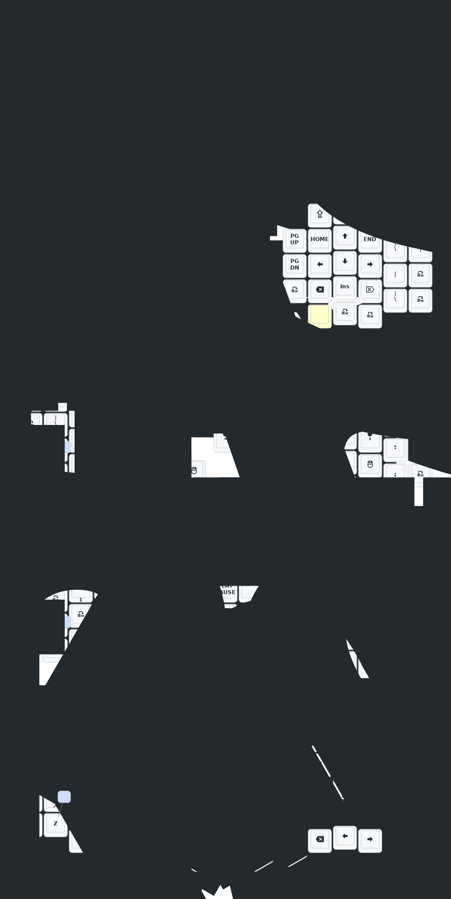

# Eyelash Sofle Aliexpress

## Features

### Home Row Mods

Home Row Mod-Tap keys are set with `tap-preferred` flavor, on both base layers for Windows/Linux and Mac.

### Soft-Off

This triggers a deep sleep state to conserve battery. 
Keyboard can only turn back on by pressing reset hardware button, or flip on/off switch.

There's a trigger in the keymap.

## Update Keymap

Go to <https://nickcoutsos.github.io/keymap-editor/>

Select `Clipboard` and paste in content of [eyelash_sofle.json](./config/eyelash_sofle.json), and  [eyelash_sofle.keymap](./config/eyelash_sofle.keymap)

Make the change you want on the website. Then copy-paste and commit the updated keymap file.

Push your change to Github. 

Github Action will pickup the change and do 2 things:
* Build ZMK firmware
* Redraw the keymap image

## Building ZMK

Github Action automatically builds the firmware from lastest `main`.

To download the firmware, go to Github repo, under Actions tab.
Select `Build ZMK firmware` workflow, and select the lastest build.
The firmware file is under `Artifacts`.

The firmware zip file contains 3 files:
* left-side firmware with ZMK studio
* right-side firmware with screen
* debug firmware

## Flashing ZMK

Do these steps for each side:

1. Connect keyboard to computer host
2. Check the keymap, and click the key corresponding to `bootloader`
   * Note that `sys_reset` key only restarts the keyboard with current firmware, not for flashing new firmware
   * The nice-nano screen will turn blank
   * Host will detect a USB storage to connect. If you don't see USB storage, check if cable supports data transfer, or only charging.
3. Copy firwmare `uf2` file into the root of USB storage, to load the new firmware
   * Careful to load the correct firmware for left/right side 
4. Keyboard will restart if firmware loading is successful

## Eyelash Sofle Keymap

This file is updated automatically by Github Action.

